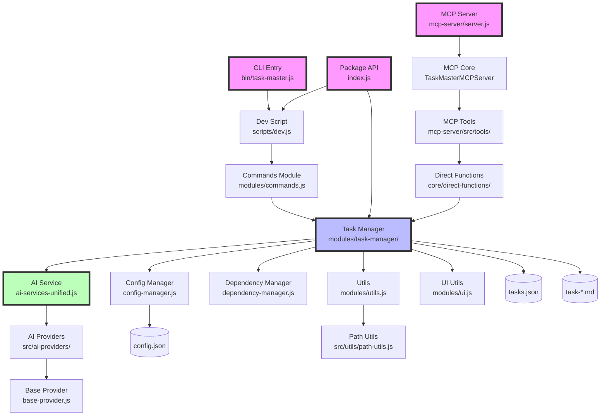

# Component Relationships and Data Flow

## Component Dependency Graph



## Data Flow Patterns

### 1. CLI Command Execution Flow

```
User Input → CLI Parser → Command Handler → Task Manager → Data Layer
                                                ↓
                                           AI Service (optional)
                                                ↓
                                           Response → UI Output
```

**Example: `task-master expand --id 1`**
1. User executes command
2. `bin/task-master.js` receives and transforms arguments
3. Delegates to `scripts/dev.js`
4. `commands.js` routes to expand command handler
5. `expandTask()` in task-manager reads tasks.json
6. Calls AI service for subtask generation
7. Updates tasks.json with new subtasks
8. Regenerates task-*.md files
9. Displays success message via UI utils

### 2. MCP Tool Invocation Flow

```
MCP Client → FastMCP Server → Tool Handler → Direct Function → Task Manager
                                                     ↓
                                                Data Layer
                                                     ↓
                                              JSON Response
```

**Example: MCP `get_tasks` tool**
1. MCP client sends tool invocation
2. FastMCP server receives via stdio
3. Routes to `get-tasks.js` tool handler
4. Tool calls `listTasksDirect()` 
5. Direct function reads tasks.json
6. Filters and formats task data
7. Returns structured response
8. FastMCP sends JSON response to client

### 3. AI Provider Selection Flow

```
Task Operation → AI Service → Provider Selection → API Call → Response
                     ↓                                ↓
              Configuration                    Fallback Chain
```

**Provider Selection Logic:**
1. Determine role (main/research/fallback)
2. Get provider config for role
3. Check API key availability
4. Create provider instance
5. Attempt API call with retries
6. On failure, try next provider in chain
7. Return result or throw error

## Inter-Component Communication

### 1. Synchronous Communication
- **Direct Function Calls**: Most internal communication
- **Import/Export**: Module dependencies
- **Return Values**: Data passed up call stack

### 2. Asynchronous Communication
- **Promises/Async-Await**: All I/O operations
- **File System**: Shared state via JSON files
- **No Event System**: No pub/sub or event emitters

### 3. Configuration Flow
```
Environment Variables
         ↓
    .env File
         ↓
  Session Data
         ↓
  config.json
         ↓
 Default Values
```

## Component Interfaces

### 1. Task Manager Interface
```javascript
// Input
{
  tasksPath: string,
  options: {
    // Command-specific options
  }
}

// Output
{
  success: boolean,
  data?: any,
  error?: string
}
```

### 2. AI Service Interface
```javascript
// Input
{
  prompt: string,
  role: 'main' | 'research' | 'fallback',
  options?: {
    temperature?: number,
    maxTokens?: number
  }
}

// Output
{
  text: string,
  usage: {
    inputTokens: number,
    outputTokens: number
  }
}
```

### 3. MCP Tool Interface
```javascript
// Input (via Zod schema)
{
  projectRoot?: string,
  // Tool-specific parameters
}

// Output
{
  success: boolean,
  data?: any,
  error?: string,
  version: string
}
```

## State Management

### 1. Persistent State
- **tasks.json**: Primary task data
- **config.json**: User configuration
- **task-*.md**: Generated task files
- **Complexity reports**: Analysis results

### 2. Runtime State
- **Context Manager**: Caches project paths
- **Provider Instances**: Singleton pattern
- **No Global State**: Each operation is stateless

### 3. State Synchronization
- **File Locking**: None (potential race condition)
- **Atomic Writes**: JSON files written completely
- **Regeneration**: Task files rebuilt after changes

## Error Propagation

### 1. Error Flow
```
Low Level Error → Wrapped with Context → Bubbled Up → User-Friendly Message
                           ↓
                    Logged if Debug
```

### 2. Error Boundaries
- **AI Providers**: Catch and retry
- **File Operations**: Graceful fallbacks
- **Command Handlers**: Top-level catch
- **MCP Tools**: Structured error responses

## Performance Characteristics

### 1. Bottlenecks
- **File I/O**: Synchronous JSON operations
- **AI Calls**: Network latency
- **Task File Generation**: Rewrites all files

### 2. Optimization Strategies
- **Caching**: Path resolution cached
- **Lazy Loading**: Providers loaded on demand
- **Batch Operations**: Multiple tasks at once

### 3. Scalability Limits
- **Task Count**: Linear performance degradation
- **File System**: OS file handle limits
- **Memory**: All tasks loaded at once

## Security Boundaries

### 1. Trust Boundaries
- **User Input**: Validated at entry points
- **File Paths**: Normalized to prevent traversal
- **AI Responses**: Treated as untrusted

### 2. Sensitive Data
- **API Keys**: Never logged or exposed
- **Project Data**: Confined to project directory
- **No Network State**: All data local

## Extension Points

### 1. Plugin Interfaces
- **AI Providers**: Extend BaseAIProvider
- **Commands**: Register in commands.js
- **MCP Tools**: Add to tools directory

### 2. Hook Points
- **Pre/Post Processing**: None currently
- **Middleware**: Not implemented
- **Event Handlers**: No event system

### 3. Configuration Extensions
- **Custom Models**: Add to supported-models.json
- **Provider Settings**: Extend config schema
- **Tool Parameters**: Modify Zod schemas